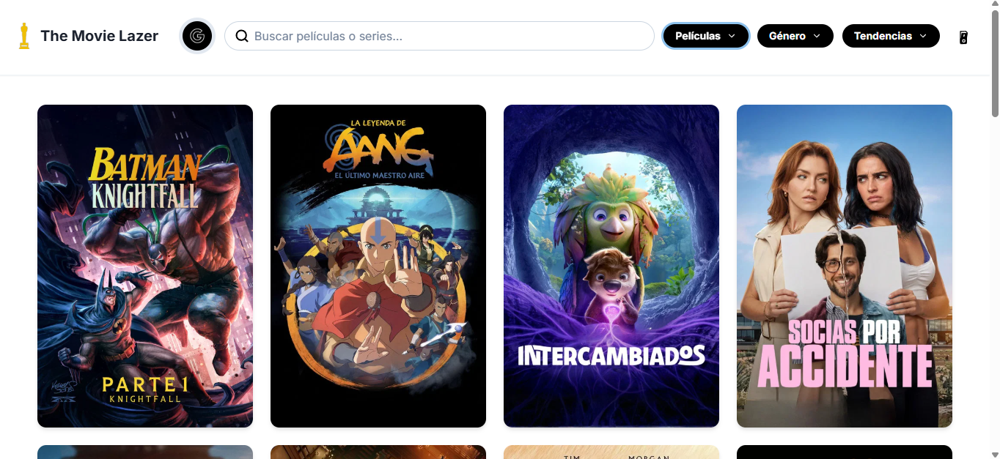
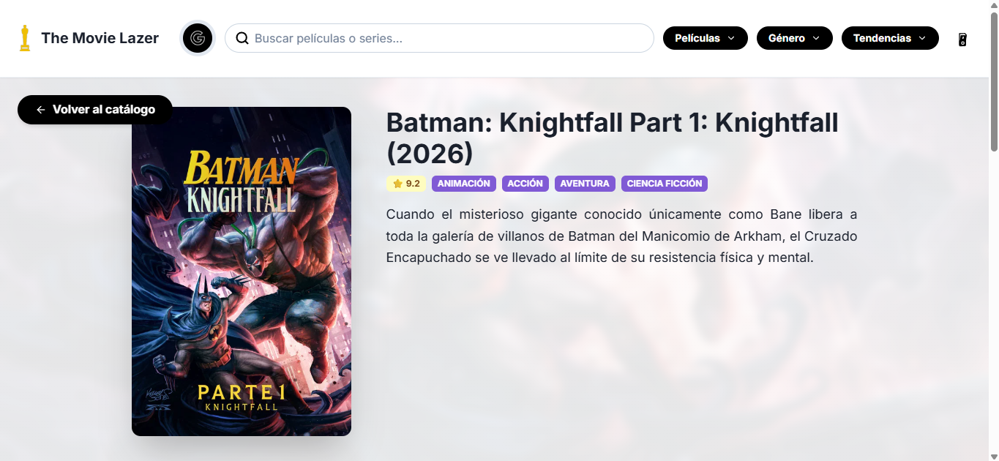
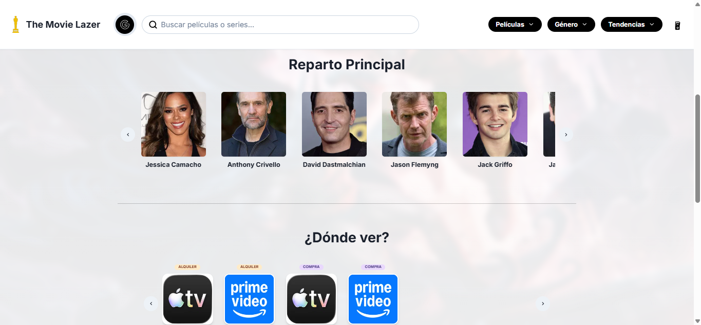
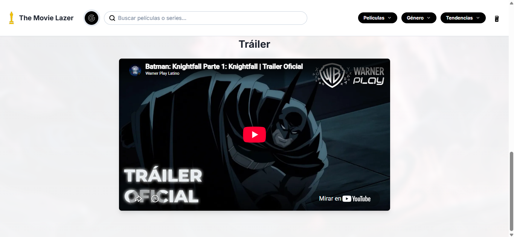

# 🎬 TheMoovieLazer

**Explorador interactivo de películas y series con catálogo dinámico, tráilers, detalles de reparto y modo oscuro.**

[Ver Características](#-características-principales) • [Capturas](#-capturas-de-pantalla) • [Tecnologías](#-tecnologías-utilizadas)

---

## 📖 Descripción del Proyecto

**TheMoovieLazer** es una aplicación web moderna y reactiva diseñada para los apasionados del cine y las series. Permite descubrir, buscar y explorar información detallada de miles de títulos.

La plataforma ofrece una experiencia fluida e inmersiva, permitiendo ver detalles de selección, conocer el reparto, disponibilidad en plataformas de streaming, visualizar tráilers y disfrutar de una interfaz adaptable gracias a su soporte para modo oscuro.

---

## 📸 Capturas de Pantalla

### 1. Pantalla de Inicio

> Exploración del catálogo principal con los títulos más populares y destacados.

---

### 2. Selección de Título

> Vista detallada al seleccionar una película o serie, con información relevante.

---

### 3. Reparto y Streaming

> Información completa sobre los actores principales y las plataformas donde el título está disponible para visualización.

---

### 4. Tráiler Integrado

> Reproducción del tráiler oficial directamente dentro de la aplicación.

---

### 5. Modo Oscuro

> Interfaz amigable para la vista, adaptada para entornos de poca luz o preferencias del usuario.

---

## ✨ Características Principales

- **🔍 Exploración Dinámica:** Catálogo completo de películas y series con información detallada.
- **🎬 Detalles Completos:** Sinopsis, valoraciones, reparto y disponibilidad en plataformas de streaming.
- **▶️ Reproducción de Tráilers:** Visualiza los avances de las películas directamente en la interfaz.
- **🌓 Modo Oscuro y Claro:** Tema visual seleccionable para adaptar la experiencia a tus preferencias.
- **⚡ Rendimiento Óptimo:** Construido con React y Vite para garantizar tiempos de carga rápidos y una navegación fluida.
